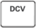
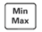
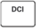
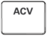
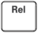
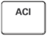
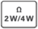
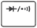
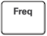

# Agilent U3402A

## Команды RS232

> **В командах RS232 можно использовать только заглавные буквы.**

### Команды кнопок

| Команда | Функция | Команда | Функция |
| :---: | :--- | :---: | :--- |
| K1 | Нажать  | K11 | Нажать  |
| K2 | Нажать   | K12 | Нажать  |
| K3 | Нажать   | K14 | Нажать  |
| K4 | Нажать  | K15 | Нажать  |
| K5 | Нажать  | K16 | Нажать  |
| K6 | Нажать  | K17 | Одновременно нажать  и  |
| K7 | Нажать  | K18 | Одновременно нажать  и  |
| K8 | Нажать  | K19 | Нажать   Увеличить яркость VFD индикатора |
| K9 | Нажать  | K20 | Нажать   Уменьшить яркость VFD индикатора |
| K10 | Нажать  |

### Команды установки

Эти команды задают режим работы мультиметра.

**Команды S1 и S2**

Эти команды задают диапазон измерений и частоту отображения основного и дополнительного дисплеев соответственно. Команды S1 и S2 используются в комбинации с параметрами `<f>`, `<r>` и `<x>`, справка по которым приведена в таблице ниже.

| Команда | Параметр | Описание | Значение |
| :---: | :---: | :--- | :--- |
| `S1<f><r><x>`| `<f>` | Режим измерений основного индикатора. | от 0 до 9 |
| `S2<f><r><x>` | `<f>` | Режим измерений второго индикатора. Второй индикатор может отображать только DCV, ACV, DCI, ACI и частоту. | 0, 1, 4, 5, 7 |
| | `<r>` | Необязательный параметр. Этот параметр задаёт диапазон измерений. Если параметр `<r>` не задан, то параметр `<x>` должен быть проигнорирован. Мультиметр установит автоматический предел измерений и будет поддержить текущую частоту измерений. | от 0 до 7 |
| | `<x>` | Необязательный параметр. Этот параметр задаёт частоту измерений. Если параметр `<x>` не задан, то мультиметр будет использовать текущую частоту измерений. | S M F |

**Комбинации параметров `<f>`, `<r>` и `<x>` для команд S1 и S2**

| Режим измерений | &lt;f&gt; S1 | &lt;f&gt; S2 | &lt;r&gt; | &lt;x&gt; S | &lt;x&gt; M | &lt;x&gt; F |
| --- | --- | --- | --- | --- | --- | --- |
| DCV | 0 | 0 | 0 1 2 3 4 5 | Автоматически 120 mV 1.2 V 12 V 120 V 1000 V | Автоматически 400 mV 4.0 V 40 V 400 V 1000 V| Автоматически 400 mV 4.0 V 40 V 400 V 1000 V |
| ACV | 1 | 1 | 0 1 2 3 4 5 | Автоматически 120 mV 1.2 V 12 V 120 V 750 V | Автоматически 400 mV 4.0 V 40 V 400 V 750 V | Автоматически 400 mV 4.0 V 40 V 400 V 750 V |
| Сопротивление 2-х проводное | 2 | нет | 0 1 2 3 4 5 6 7 | Автоматически 120 Ом 1.2 кОм 12 кОм 120 кОм 1.2 МОм 12 МОм 120 МОм | Автоматически 400 Ом 4.0 кОм 40 кОм 400 кОм 4.0 МОм 40 МОм 300 МОм | Автоматически 400 Ом 4.0 кОм 40 кОм 400 кОм 4.0 МОм 40 МОм 300 МОм |
| Сопротивление 4-х проводное | 3 | нет | 0 1 2 3 4 5 6 7 | Автоматически 120 Ом 1.2 кОм 12 кОм 120 кОм 1.2 МОм 12 МОм 120 МОм | Автоматически 400 Ом 4.0 кОм 40 кОм 400 кОм 4.0 МОм 40 МОм 300 МОм | Автоматически 400 Ом 4.0 кОм 40 кОм 400 кОм 4.0 МОм 40 МОм 300 МОм |
| DCI | 4 | 4 | 0 1 2 3 4 | Автоматически 12 mA 120 mA 1.2 A 12 A | Автоматически 40 mA 120 mA 1.2 A 12 A | Автоматически 40 mA 120 mA 1.2 A 12 A |
| ACI | 5 | 5 | 0 1 2 3 4 | Автоматически 12 mA 120 mA 1.2 A 12 A | Автоматически 40 mA 120 mA 1.2 A 12 A | Автоматически 40 mA 120 mA 1.2 A 12 A |
| Диод | 6 | нет | 0 1 | Автоматически 1.2 V | Автоматически 2.5 V | Автоматически 2.5 V |
| Частота | 7 | 7 | 0 1 2 3 4 | Автоматически 1200 Hz 12 kHz 120 kHz 1 MHz | Автоматически 1200 Hz 12 kHz 120 kHz 1 MHz | Автоматически 1200 Hz 12 kHz 120 kHz 1 MHz |
| Vac+dc | 8 | нет | 0 1 2 3 4 5 | Автоматически 120 mV 1.2 V 12 V 120 V 750 V | Автоматически 400 mV 4.0 V 40 V 400 V 750 V | Автоматически 400 mV 4.0 V 40 V 400 V 750 V |
| Iac+dc | 9 | нет | 0 1 2 3 4 | Автоматически 12 mA 120 mA 1.2 A 12 A | Автоматически 40 mA 120 mA 1.2 A 12 A | Автоматически 40 mA 120 mA 1.2 A 12 A |
| Вкл/Выкл (Ohm / 2W Ohm) | A | нет | 0 1 2 3 4 5 6 7 | Автоматически 120 Ом 1.2 кОм 12 кОм 120 кОм 1.2 МОм 12 МОм 120 МОм | Автоматически 400 Ом 4.0 кОм 40 кОм 400 кОм 4.0 МОм 40 МОм 300 МОм | Автоматически 400 Ом 4.0 кОм 40 кОм 400 кОм 4.0 МОм 40 МОм 300 МОм |

**Команда SH**

Команда используется для задания верхнего лимита операции сравнения. Команда используется в комбинации с параметрами `<s>` и `<числовое_значение>`.

| Синтаксис | Параметр | Описание | Диапазон значений |
| --- | --- | --- | --- |
| `SH<s><числовое_значение>` | `<s>` | Этот параметр задаёт идентификатор верхнего лимита. | + - |
| `SH<s><числовое_значение>` | `<числовое_значение>` | Этот параметр задаёт 6 цифр для значения верхнего лимита | 000000 до 199999 |

**Команда SL**

Команда используется для задания нижнего лимита операции сравнения. Команда используется в комбинации с параметрами `<s>` и `<числовое_значение>`.

| Синтаксис | Параметр | Описание | Диапазон значений |
| --- | --- | --- | --- |
| `SH<s><числовое_значение>` | `<s>` | Этот параметр задаёт идентификатор нижнего лимита. | + - |
| `SH<s><числовое_значение>` | `<числовое_значение>` | Этот параметр задаёт 6 цифр для значения нижнего лимита | 000000 до 199999 |

**Команда SR**

Команда используется для задания относительной базы относительных операций. Команда используется в комбинации с параметрами `<s>` и `<числовое_значение>`.

| Синтаксис | Параметр | Описание | Диапазон значений |
| --- | --- | --- | --- |
| `SH<s><числовое_значение>` | `<s>` | Этот параметр задаёт идентификатор верхнего лимита. | + - |
| `SH<s><числовое_значение>` | `<числовое_значение>` | Этот параметр задаёт 6 цифр для значения верхнего лимита | 000000 до 199999 |

**Команда SO**

Команда используется для выбора эталонного импеданса для расчёта dBm. Команда используется в сочетании с `<числовое_значение>`.

| Синтаксис | Параметр | Описание | Диапазон значений |
| --- | --- | --- | --- |
| `SO<числовое_значение>` | `<числовое_значение>` | Этот параметр выбирает опорное сопротивление (смотри таблицу ниже) | от 00 до 20 |

| | Импеданс | | Импеданс | | Импеданс |
|---|:---:|---|:---:|---|:---:|
| 00 | 2 Ω | 07 | 110 Ω | 14 | 500 Ω |
| 01 | 4 Ω | 08 | 124 Ω | 15 | 600 Ω |
| 02 | 8 Ω | 09 | 125 Ω | 16 | 800 Ω |
| 03 | 16 Ω | 10 | 135 Ω | 17 | 900 Ω |
| 04 | 50 Ω | 11 | 150 Ω | 18 | 1000 Ω |
| 05 | 75 Ω | 12 | 250 Ω | 19 | 1200 Ω |
| 06 | 93 Ω | 13 | 300 Ω | 20 | 8000 Ω |

### Команды опроса

**Команда R0**

Запрашивает текущий статус мультиметра. После получения команды R0, мультиметр вернёт строку, содержащую 10 символов.

`<h1h2><g1g2><v><x><f1><r1><f2><r2>`

| Параметр | Комментарий | Значение |
| --- | --- | --- |
| `<h1,h2>` | `<h1h2>` - двухзначное шестнадцатеричное число, каждая цифра представляет собой четырёхзначный двоичный код (биты с 7 по 4 и биты с 3 по 0). Эта строка используется для представления восьми состояний мультиметра.  `<h1>` представляет состояние ВКЛ или ВЫКЛ математических операций. `<h2>` представляет результат операции сравнения и тип отображения.  Чтобы определить состояние мультиметра, преобразуйте строку в 8-битный двоичный код и обратитесь к Таблице 4-10.  Пример: Если `<h1h2>` равен `<82>`, 8-битный двоичный код равен "10000010". Согласно Таблице 4-10, мультиметр находится в режиме одного индикатора, операция сравнения находится в состоянии ВКЛ, а результат - ПРОЙДЕН. | от 0 до 9 |
| `<g1g2>` | `<g1g2>` - двухзначное шестнадцатеричное число, каждая цифра представляет собой четырёхзначный двоичный код (биты с 7 по 4 и биты с 3 по 0). Эта строка используется для представления восьми типов состояний мультиметра.  `<g1>` представляет четыре типа работы мультиметра. `<g2>` представляет состояние ВКЛ или ВЫКЛ остальных четырёх типов работы мультиметра.  Чтобы определить состояние мультиметра, преобразуйте строку в 8-битный двоичный код и обратитесь к Таблице 4-11.  Пример: Если `<g1g2>` равен `<18>`, 8-битный двоичный код "00011000". Согласно таблице 4-11, основной индикатор мультиметра находится в режиме автоматического выбора диапазона, а операции считывания приостановлены. | от 0 до 9 |
| `<v>` | Представляет яркость VFD индикатора 0 = 50% яркости 1 = 60% яркости 2 = 75% яркости 3 = 100% яркости | от 0 до 3 |
| `<x>` | Частота считываний S = Медленный M = Средний F = Быстрый | S M F |
| `<f1>` | Режим измерения основного индикатора. Для подробной информации о `<f1 r1>` и `<f2 r2>` смотрите таблицу 4-12. | от 0 до 9 A |
| `<r1>` | Диапазон измерений основного индикатора. Для подробной информации о `<f1 r1>` и `<f2 r2>` смотрите таблицу 4-12. | от 1 до 7 |
| `<f2>` | Режим измерения второго индикатора. Для подробной информации о `<f1 r1>` и `<f2 r2>` смотрите таблицу 4-12. | от 0 до 9 A |
| `<r2>` | Диапазон измерений второго индикатора. Для подробной информации о `<f1 r1>` и `<f2 r2>` смотрите таблицу 4-12. | от 1 до 7 |

**Таблица 4-10**

| `<h1h2>` | Бит | Состояние | 0 | 1 |
| --- | --- | --- | --- | --- |
| `<h1>` | 7 6 5 4 | Операция сравнения Относительные операции Мощность dB Мощность dBm | ВЫКЛ ВЫКЛ ВЫКЛ ВЫКЛ | ВКЛ ВКЛ ВКЛ ВКЛ |
| `<h2>` | 3 2 1 0 | Тип индикатора Сравнение результата Сравнение результата Сравнение результата | Одиночный - - - | Двойной Больше Пройден Меньше |

**Таблица 4-11**

| `<g1g2>` | Бит | Статус | 0 | 1 |
| --- | --- | --- | --- | --- |
| `<g1>` | 7 6 5 4 | Калибровка Дополнительный индикатор Shift Hold | ВЫКЛ ВЫКЛ ВЫКЛ ВЫКЛ | ВКЛ ВКЛ ВКЛ ВКЛ |
| `<g2>` | 3 2 1 0 | Автоматический диапазон на главном индикаторе Автоматический диапазон на дополнительном индикаторе Минимальная операция Максимальная операция | ВЫКЛ ВЫКЛ ВЫКЛ ВЫКЛ | ВКЛ ВКЛ ВКЛ ВКЛ |

**Таблица 4-12**

| Режим измерений | &lt;f1&gt; | &lt;f2&gt; | &lt;r1&gt; или &lt;r2&gt; | &lt;x&gt; S | &lt;x&gt; M | &lt;x&gt; F |
| --- | --- | --- | --- | --- | --- | --- |
| DCV | 0 | 0 | 0 1 2 3 4 5 | Автоматически 120 mV 1.2 V 12 V 120 V 1000 V | Автоматически 400 mV 4.0 V 40 V 400 V 1000 V| Автоматически 400 mV 4.0 V 40 V 400 V 1000 V |
| ACV | 1 | 1 | 0 1 2 3 4 5 | Автоматически 120 mV 1.2 V 12 V 120 V 750 V | Автоматически 400 mV 4.0 V 40 V 400 V 750 V | Автоматически 400 mV 4.0 V 40 V 400 V 750 V |
| Сопротивление 2-х проводное | 2 | нет | 0 1 2 3 4 5 6 7 | Автоматически 120 Ом 1.2 кОм 12 кОм 120 кОм 1.2 МОм 12 МОм 120 МОм | Автоматически 400 Ом 4.0 кОм 40 кОм 400 кОм 4.0 МОм 40 МОм 300 МОм | Автоматически 400 Ом 4.0 кОм 40 кОм 400 кОм 4.0 МОм 40 МОм 300 МОм |
| Сопротивление 4-х проводное | 3 | нет | 0 1 2 3 4 5 6 7 | Автоматически 120 Ом 1.2 кОм 12 кОм 120 кОм 1.2 МОм 12 МОм 120 МОм | Автоматически 400 Ом 4.0 кОм 40 кОм 400 кОм 4.0 МОм 40 МОм 300 МОм | Автоматически 400 Ом 4.0 кОм 40 кОм 400 кОм 4.0 МОм 40 МОм 300 МОм |
| DCI | 4 | 4 | 0 1 2 3 4 | Автоматически 12 mA 120 mA 1.2 A 12 A | Автоматически 40 mA 120 mA 1.2 A 12 A | Автоматически 40 mA 120 mA 1.2 A 12 A |
| ACI | 5 | 5 | 0 1 2 3 4 | Автоматически 12 mA 120 mA 1.2 A 12 A | Автоматически 40 mA 120 mA 1.2 A 12 A | Автоматически 40 mA 120 mA 1.2 A 12 A |
| Диод | 6 | нет | 0 1 | Автоматически 1.2 V | Автоматически 2.5 V | Автоматически 2.5 V |
| Частота | 7 | 7 | 0 1 2 3 4 | Автоматически 1200 Hz 12 kHz 120 kHz 1 MHz | Автоматически 1200 Hz 12 kHz 120 kHz 1 MHz | Автоматически 1200 Hz 12 kHz 120 kHz 1 MHz |
| Vac+dc | 8 | нет | 0 1 2 3 4 5 | Автоматически 120 mV 1.2 V 12 V 120 V 750 V | Автоматически 400 mV 4.0 V 40 V 400 V 750 V | Автоматически 400 mV 4.0 V 40 V 400 V 750 V |
| Iac+dc | 9 | нет | 0 1 2 3 4 | Автоматически 12 mA 120 mA 1.2 A 12 A | Автоматически 40 mA 120 mA 1.2 A 12 A | Автоматически 40 mA 120 mA 1.2 A 12 A |
| Вкл/Выкл (Ohm / 2W Ohm) | A | нет | 0 1 2 3 4 5 6 7 | Автоматически 120 Ом 1.2 кОм 12 кОм 120 кОм 1.2 МОм 12 МОм 120 МОм | Автоматически 400 Ом 4.0 кОм 40 кОм 400 кОм 4.0 МОм 40 МОм 300 МОм | Автоматически 400 Ом 4.0 кОм 40 кОм 400 кОм 4.0 МОм 40 МОм 300 МОм |

**Команда R1**

Мультиметр вернёт последнее значение на основном индикаторе

Пример:

+110.234E+0

**Команда R2**

Мультиметр вернёт последнее значение на дополнительном индикаторе

**Команда RALL**

Команда RALL является комбинацией команд R1 и R2.

**Команда RST**

Команда выполнит сброс мультиметра к его начальному состоянию без выключения питания. Рекомендуется ждать 4 секунды перед выполнением команды.

**Команда RV**

Возвращает версию прошивки и номер модели мультиметра.

Синтаксис `<vx.xx>,<m>`

- `<vx.xx>` - текущая версия прошивки
- `<m>` - номер модели
